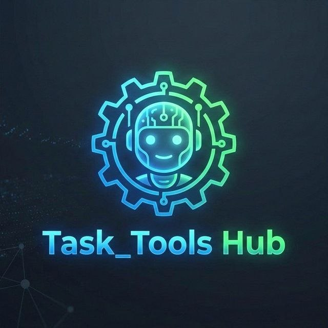

  

# 📱 Termux Skill Master v4.6

## 📝 Description
**Termux Skill Master** is an advanced script for creating "Skills" and AI configurations, specifically designed for use via **Termux-Widget**. It transforms your smartphone into a high-performance coding and automation station, allowing you to launch complex workflows directly from your phone's home screen without manual terminal interaction.

Developed entirely with AI support, this tool offers a seamless and automated experience for generating bots, scripts, and structured interaction logic with your favorite AI Chatbots.

## 🛠️ Key Features
*   **Widget Integration:** Launch the Skill Generator instantly with a single tap directly from your Home screen.
*   **Clipboard Automation (Termux:API Magic):** Every generated prompt or Skill is automatically and instantly saved to your smartphone's clipboard. Just open your AI Chatbot and hit "Paste" to start working immediately.
*   **cat-EOF Protocol:** Bypass the limitations of mobile text editors (like nano) for lightning-fast, error-free code writing.
*   **Architectural Security:** External configuration for Tokens and API Keys in isolated files (`config.json` / `.env`) to protect sensitive data during sharing.
*   **Advanced Data Management:** Native support for JSON databases, error logging (`errori.log`), and Infinity Polling system integration.
*   **AI-Driven Workflow:** Optimized to generate high-precision "skill matrices" that make AI interaction incredibly accurate and structured.

## 📦 Requirements
To ensure full functionality, you must install the following on your Android device (preferably via **F-Droid**):
1.  **Termux:** The Linux terminal emulator to host the Python environment.
2.  **Termux:API:** The essential extension for system interaction (e.g., auto-copy to clipboard).
3.  **Termux:Widget:** The extension for quick home-screen script activation via visual shortcuts.

## 🎮 How to Use
1.  Go to your Android **Home Screen**.
2.  Add the **Termux Widget** to your screen.
3.  Tap the **SkillMaster** button.
4.  Follow the guided prompts to define your project (Python Tools, APIs, Theoretical Study, etc.).
5.  The script will automatically copy the **"Master Prompt"** to your clipboard and ask if you want to create the empty `.py` file in the project folder.
6.  **Paste the prompt** into your favorite AI Chatbot.
7.  When the AI responds with code encapsulated in **cat-EOF format**, copy the entire block and paste it into your Termux terminal to see your project come to life instantly!

---
*Note: This repository also includes an Italian version (`skill_master_it.py`) for the local community.*
